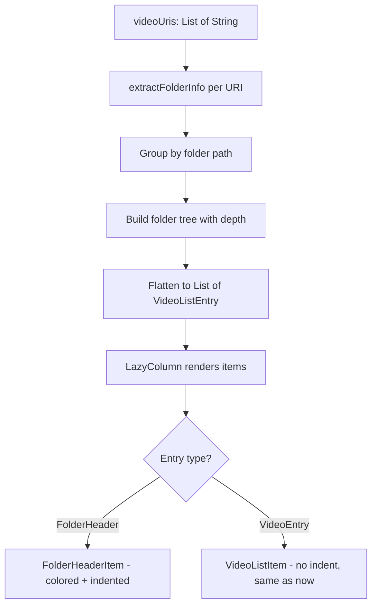
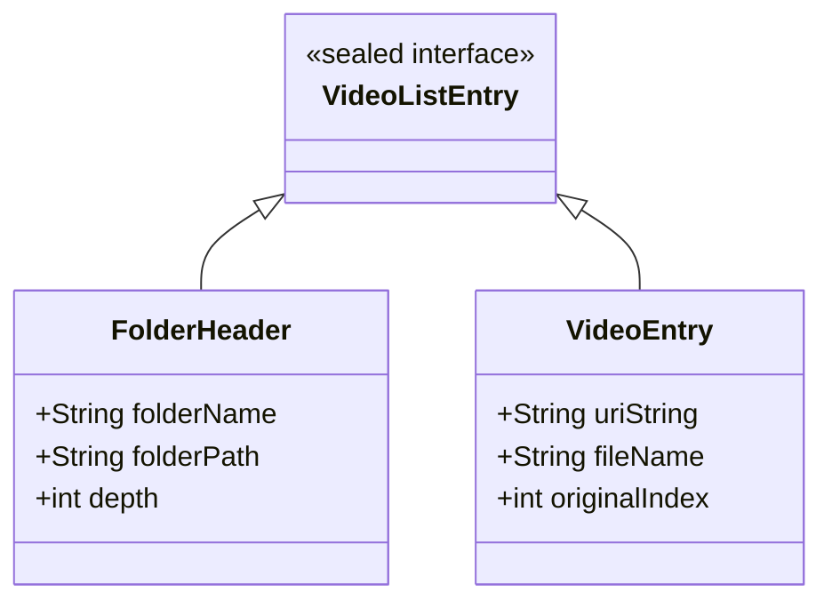

# Plan: Group Files by Folders in Parent Dashboard

## Goal
In the parent dashboard (`ParentDashboardScreen`), group the flat video list by folders. Show folder headers as separate rows with a distinct color, subfolder headers with indentation, and files without indentation (as they are now).

## Current State
- `ParentDashboardScreen` shows a **flat** list of all video URIs via `LazyColumn` + `itemsIndexed`
- Each item is rendered by `VideoListItem` composable — extracts filename from `uri.lastPathSegment`
- URIs come in two schemes:
  - `file:///storage/emulated/0/Movies/video.mp4` — from custom file picker
  - `content://com.android.externalstorage.documents/document/primary%3AMovies%2Fvideo.mp4` — from SAF

## Proposed Visual Layout

```
📁 Movies                          ← folder header (FolderBlue color, no indent)
   video1.mp4                    ✕  ← file (no indent, same as now)
   video2.mp4                    ✕
📁 Anime                           ← subfolder header (FolderBlue, indented)
   naruto_ep1.mp4                ✕
   naruto_ep2.mp4                ✕
📁 Downloads                       ← folder header (FolderBlue, no indent)
   funny_cat.mp4                 ✕
```

- **Folder headers**: colored with `FolderBlue`, bold, with folder icon 📁, indented based on nesting depth
- **Files**: no indentation, same style as current `VideoListItem`
- **Subfolders**: indented relative to their parent folder depth

## Architecture

### Mermaid: Data Flow



### Mermaid: Sealed Class Hierarchy



## Implementation Steps

### Step 1: Create Data Model — `VideoListEntry`

Location: inside `ParentDashboardScreen.kt` or a new file `ui/screens/VideoListEntry.kt`

```kotlin
sealed interface VideoListEntry {
    data class FolderHeader(
        val folderName: String,   // e.g. "Movies" or "Anime"
        val folderPath: String,   // full path for identification
        val depth: Int            // 0 = top-level, 1 = subfolder, etc.
    ) : VideoListEntry

    data class VideoEntry(
        val uriString: String,    // original URI string
        val fileName: String,     // display name
        val originalIndex: Int    // index in flat list for onPlayVideo callback
    ) : VideoListEntry
}
```

### Step 2: Create Folder Extraction Utility

Handle both URI schemes:

```kotlin
fun extractFolderInfo(uriString: String): Pair<String, String>? {
    val uri = Uri.parse(uriString)
    return when (uri.scheme) {
        "file" -> {
            // file:///storage/emulated/0/Movies/video.mp4
            // → folder: /storage/emulated/0/Movies
            val path = uri.path ?: return null
            val lastSlash = path.lastIndexOf('/')
            if (lastSlash > 0) path.substring(0, lastSlash) to uri.lastPathSegment.orEmpty()
            else null
        }
        "content" -> {
            // content://.../document/primary%3AMovies%2Fvideo.mp4
            // lastPathSegment = "primary:Movies/video.mp4"
            val segment = uri.lastPathSegment ?: return null
            val colonIdx = segment.indexOf(':')
            val relative = if (colonIdx >= 0) segment.substring(colonIdx + 1) else segment
            val lastSlash = relative.lastIndexOf('/')
            if (lastSlash > 0) {
                val folder = relative.substring(0, lastSlash)
                val fileName = relative.substring(lastSlash + 1)
                folder to fileName
            } else null
        }
        else -> null
    }
}
```

### Step 3: Create Grouping Function

```kotlin
fun groupVideosByFolder(uris: List<String>): List<VideoListEntry> {
    // 1. For each URI, extract (folderPath, fileName)
    // 2. Group URIs by folderPath → Map<String, List<Pair<String, String>>>
    // 3. Sort folder paths alphabetically
    // 4. For each folder, determine depth:
    //    - Find common root (longest common prefix of all folder paths)
    //    - depth = segments below common root
    //    - Or simpler: depth = number of segments relative to shallowest folder
    // 5. Flatten: for each folder emit FolderHeader, then its VideoEntry items
    // 6. URIs that fail parsing → group under "Unknown" header at depth 0
}
```

**Depth calculation example:**
- Folders: `/storage/emulated/0/Movies`, `/storage/emulated/0/Movies/Anime`, `/storage/emulated/0/Downloads`
- Common root: `/storage/emulated/0`
- Depths: `Movies` → 0, `Movies/Anime` → 1, `Downloads` → 0

### Step 4: Create `FolderHeaderItem` Composable

```kotlin
@Composable
fun FolderHeaderItem(
    folderName: String,
    depth: Int
) {
    val indent = depth * 16.dp  // 16dp per nesting level
    Row(
        modifier = Modifier
            .fillMaxWidth()
            .padding(start = indent + 12.dp, top = 4.dp, bottom = 2.dp),
        verticalAlignment = Alignment.CenterVertically
    ) {
        Text(
            text = "📁 $folderName",
            fontSize = 13.sp,
            fontWeight = FontWeight.SemiBold,
            color = FolderBlue
        )
    }
}
```

### Step 5: Update `ParentDashboardScreen`

Replace the current `itemsIndexed(items = videoUris)` block:

```kotlin
// Transform flat URI list into grouped entries
val groupedEntries by remember {
    derivedStateOf { groupVideosByFolder(videoUris) }
}

LazyColumn(...) {
    items(
        items = groupedEntries,
        key = { entry -> when (entry) {
            is VideoListEntry.FolderHeader -> "folder:${entry.folderPath}"
            is VideoListEntry.VideoEntry -> "video:${entry.uriString}"
        }}
    ) { entry ->
        when (entry) {
            is VideoListEntry.FolderHeader -> FolderHeaderItem(
                folderName = entry.folderName,
                depth = entry.depth
            )
            is VideoListEntry.VideoEntry -> VideoListItem(
                index = entry.originalIndex,
                uriString = entry.uriString,
                onClick = { pendingPlayIndex = entry.originalIndex },
                onRemove = {
                    coroutineScope.launch {
                        videoRepository.removeVideoUri(entry.uriString)
                    }
                }
            )
        }
    }
}
```

## Files to Modify

| File | Change |
|------|--------|
| `ParentDashboardScreen.kt` | Add `VideoListEntry` sealed interface, grouping logic, `FolderHeaderItem` composable, update `LazyColumn` |
| `Color.kt` | No changes needed — reuse existing `FolderBlue` |

## Edge Cases

1. **Unparseable URIs** → group under a generic header like "Другие" at depth 0
2. **Single folder** → still show the folder header for consistency
3. **Mixed URI schemes** → each scheme produces different folder paths, they sort independently
4. **Empty folder path** (file in root) → group under "/" or skip folder header
5. **URI permissions** → no change needed, URIs remain unchanged in storage
