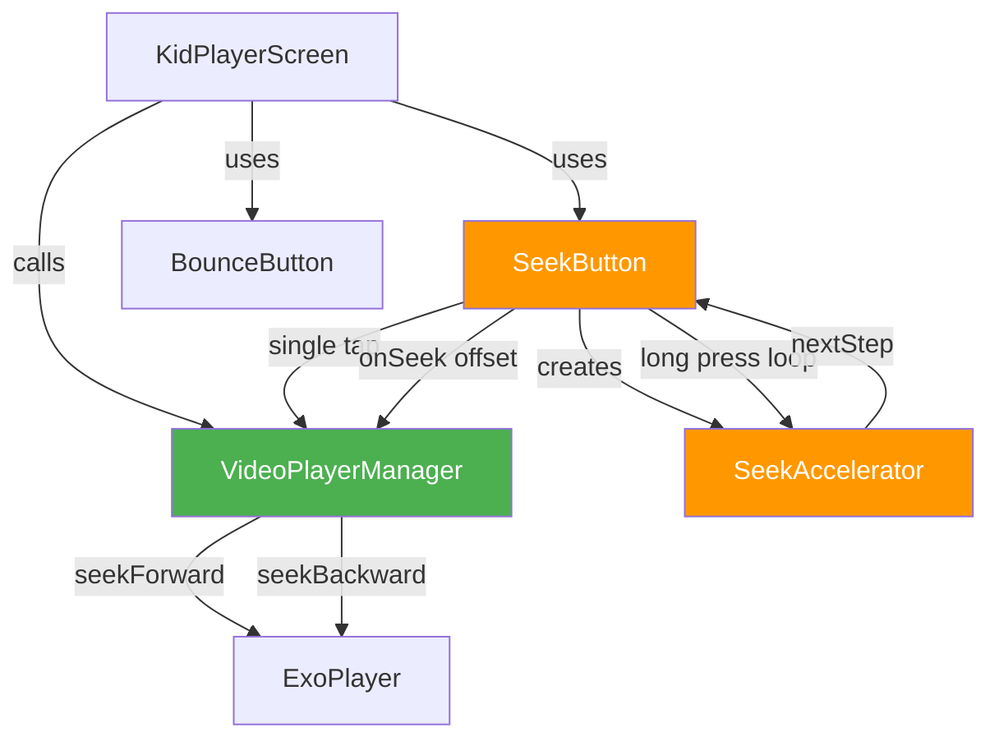
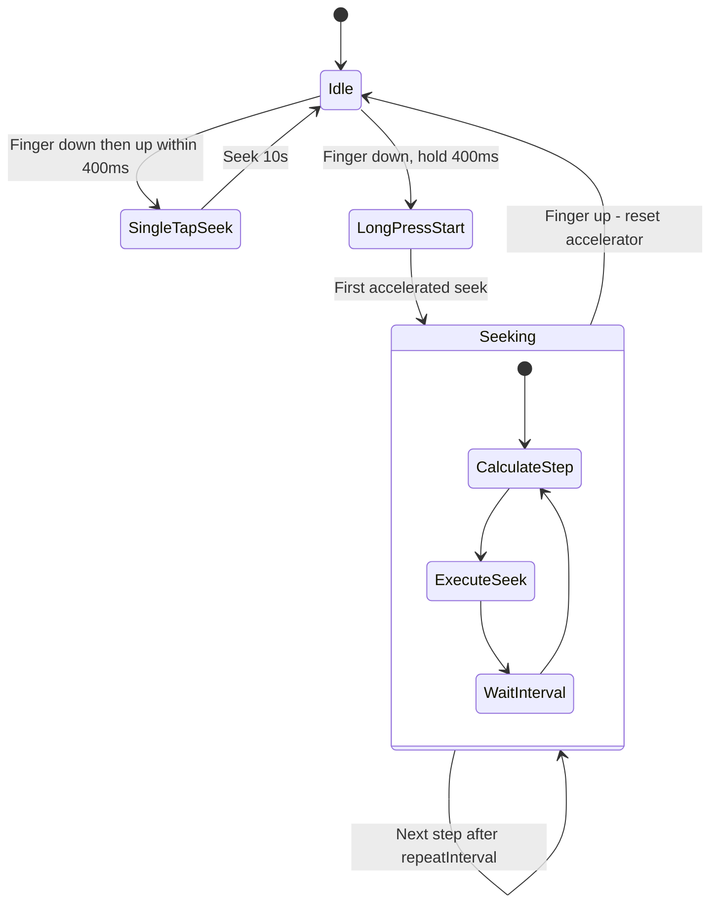

# Seek Forward/Backward Buttons — Implementation Plan

## 1. Current Code Structure Summary

### [`KidPlayerScreen.kt`](app/src/main/java/com/dima/kidsvideoplayer/ui/screens/KidPlayerScreen.kt)
- Full-screen `Box` layout with an `AndroidView` wrapping a Media3 `PlayerView`
- Bottom `Row` with `Arrangement.SpaceEvenly` containing navigation buttons:
  - **⏮ Previous** — visible only when `videoUris.size > 1`
  - **▶/⏸ Play/Pause** — always visible, toggles via `exoPlayer.isPlaying`
  - **⏭ Next** — visible only when `videoUris.size > 1`
- Buttons use the [`BounceButton`](app/src/main/java/com/dima/kidsvideoplayer/ui/components/BounceButton.kt) composable
- A "v1.0" secret door at `BottomEnd` with long-press → PIN dialog
- Playback state tracked reactively via `Player.Listener`

### [`VideoPlayerManager.kt`](app/src/main/java/com/dima/kidsvideoplayer/player/VideoPlayerManager.kt)
- Wraps `ExoPlayer` with lifecycle methods: `initialize()`, `release()`, `setVideoList()`
- Navigation: `next()`, `previous()` — both delegate to `exoPlayer.seekToNext/Previous()`
- **No `seekTo()` method exists yet** — needs to be added
- Exposes `player: ExoPlayer?` as a public read-only property

### [`BounceButton.kt`](app/src/main/java/com/dima/kidsvideoplayer/ui/components/BounceButton.kt)
- `BounceButton` composable: spring-based scale animation on press + subtle idle pulse
- Params: `text`, `onClick`, `backgroundColor`, `textColor`, `icon`, `size`, `fontSize`
- `NavBounceButton` variant: convenience wrapper with preset size/colors
- **Limitation**: `BounceButton` only supports a single `onClick` — no long-press or repeated-press API

### [`AppState.kt`](app/src/main/java/com/dima/kidsvideoplayer/AppState.kt)
- **File does not exist in the project.** App state is managed within composables and via `KidsVideoApp` (simple `Application` subclass). No centralized state container.

---

## 2. Files to Modify/Create

| File | Action | Purpose |
|------|--------|---------|
| [`VideoPlayerManager.kt`](app/src/main/java/com/dima/kidsvideoplayer/player/VideoPlayerManager.kt) | **Modify** | Add `seekForward()` and `seekBackward()` methods |
| `ui/components/SeekButton.kt` | **Create** | New composable with single-tap + progressive long-press seek |
| [`KidPlayerScreen.kt`](app/src/main/java/com/dima/kidsvideoplayer/ui/screens/KidPlayerScreen.kt) | **Modify** | Add seek buttons to the bottom control row |
| `player/SeekAccelerator.kt` | **Create** | Utility class encapsulating the acceleration algorithm |

---

## 3. Seek Acceleration Algorithm

### Design Goals
- Single tap → fixed **10 seconds** seek
- Long press → repeated seeks with **progressively increasing step size**
- Maximum single seek step: **600 seconds** (10 minutes)
- Smooth, predictable acceleration that feels natural for a kids app

### Algorithm: Exponential Step Growth with Fixed Interval

```
Initial step:     10s
Growth factor:    1.5x per iteration
Repeat interval:  400ms between seeks
Maximum step:     600s
```

| Iteration | Step Size | Cumulative Seek | Time Elapsed |
|-----------|-----------|-----------------|--------------|
| 1         | 10s       | 10s             | 0ms          |
| 2         | 15s       | 25s             | 400ms        |
| 3         | 22s       | 47s             | 800ms        |
| 4         | 33s       | 80s             | 1200ms       |
| 5         | 50s       | 130s            | 1600ms       |
| 6         | 75s       | 205s            | 2000ms       |
| 7         | 112s      | 317s            | 2400ms       |
| 8         | 168s      | 485s            | 2800ms       |
| 9         | 252s      | 737s            | 3200ms       |
| 10        | 378s      | 1115s           | 3600ms       |
| 11        | 600s cap  | 1715s           | 4000ms       |

### Pseudocode

```kotlin
class SeekAccelerator(
    private val initialStepMs: Long = 10_000L,
    private val growthFactor: Float = 1.5f,
    private val maxStepMs: Long = 600_000L,
    private val repeatIntervalMs: Long = 400L
) {
    private var currentStepMs: Long = initialStepMs

    fun reset() {
        currentStepMs = initialStepMs
    }

    fun nextStep(): Long {
        val step = currentStepMs
        currentStepMs = (currentStepMs * growthFactor).toLong()
            .coerceAtMost(maxStepMs)
        return step
    }
}
```

### Why This Approach
- **Exponential growth** reaches large seeks quickly — a child holding the button for 4 seconds can skip over 2 minutes of content
- **Fixed interval** keeps the UI responsive and predictable
- **Cap at 600s** prevents accidentally seeking past the entire video
- The algorithm is stateless between presses — `reset()` is called on button release

---

## 4. UI Layout Changes

### Current Layout (bottom Row)

```
[  ⏮ Prev  ]    [  ▶ Play  ]    [  ⏭ Next  ]
```

### New Layout (bottom Row)

```
[ ⏮ Prev ] [ ⏪ Seek- ] [ ▶ Play ] [ ⏩ Seek+ ] [ ⏭ Next ]
```

- Seek buttons placed between the nav buttons and the play/pause button
- Seek buttons always visible when videos exist (not gated by `videoUris.size > 1`)
- Slightly smaller than play/pause to maintain visual hierarchy

### Button Styling
- **Seek Backward**: `⏪` emoji, orange/amber background `Color(0xFFFF9800)`, size `70.dp`
- **Seek Forward**: `⏩` emoji, orange/amber background `Color(0xFFFF9800)`, size `70.dp`
- Play/pause remains the largest at `90.dp`
- Prev/Next remain at `80.dp`

### Visual Feedback During Long Press
- The existing `BounceButton` bounce animation will fire on first press
- During long-press repeated seeks, the button stays in the pressed/scaled state
- Optional: show a small seek amount indicator (e.g., "10s", "30s", "2m") above the button during long press — can be a follow-up enhancement

---

## 5. Detailed Implementation Steps

### Step 1: Create `SeekAccelerator` utility

**New file**: `app/src/main/java/com/dima/kidsvideoplayer/player/SeekAccelerator.kt`

```kotlin
package com.dima.kidsvideoplayer.player

/**
 * Calculates progressively increasing seek step sizes.
 * Each call to [nextStep] returns a larger step, capped at [maxStepMs].
 */
class SeekAccelerator(
    private val initialStepMs: Long = 10_000L,
    private val growthFactor: Float = 1.5f,
    private val maxStepMs: Long = 600_000L,
    private val repeatIntervalMs: Long = 400L
) {
    private var currentStepMs: Long = initialStepMs

    fun reset() {
        currentStepMs = initialStepMs
    }

    fun nextStep(): Long {
        val step = currentStepMs
        currentStepMs = (currentStepMs * growthFactor).toLong()
            .coerceAtMost(maxStepMs)
        return step
    }

    fun getRepeatInterval(): Long = repeatIntervalMs
}
```

### Step 2: Add seek methods to `VideoPlayerManager`

**Modify**: [`VideoPlayerManager.kt`](app/src/main/java/com/dima/kidsvideoplayer/player/VideoPlayerManager.kt)

Add two new methods after the `previous()` method (around line 115):

```kotlin
/**
 * Seek forward by the specified number of milliseconds.
 * Clamps to the end of the current media item.
 */
fun seekForward(offsetMs: Long) {
    val exoPlayer = player ?: return
    val newPosition = exoPlayer.currentPosition + offsetMs
    val duration = exoPlayer.duration
    val clamped = if (duration > 0) {
        newPosition.coerceAtMost(duration)
    } else {
        newPosition
    }
    exoPlayer.seekTo(clamped)
}

/**
 * Seek backward by the specified number of milliseconds.
 * Clamps to the start of the current media item.
 */
fun seekBackward(offsetMs: Long) {
    val exoPlayer = player ?: return
    val newPosition = (exoPlayer.currentPosition - offsetMs).coerceAtLeast(0)
    exoPlayer.seekTo(newPosition)
}
```

### Step 3: Create `SeekButton` composable

**New file**: `app/src/main/java/com/dima/kidsvideoplayer/ui/components/SeekButton.kt`

This composable handles:
- Single tap → immediate 10s seek
- Long press → repeated seeks with acceleration via coroutine

```kotlin
package com.dima.kidsvideoplayer.ui.components

import androidx.compose.foundation.gestures.detectTapGestures
import androidx.compose.foundation.layout.size
import androidx.compose.material3.Text
import androidx.compose.runtime.*
import androidx.compose.ui.Alignment
import androidx.compose.ui.Modifier
import androidx.compose.ui.graphics.Color
import androidx.compose.ui.input.pointer.pointerInput
import androidx.compose.ui.unit.dp
import androidx.compose.ui.unit.sp
import com.dima.kidsvideoplayer.player.SeekAccelerator
import kotlinx.coroutines.Job
import kotlinx.coroutines.delay
import kotlinx.coroutines.isActive

/**
 * Seek button with single-tap and progressive long-press behavior.
 *
 * - Single tap: seeks by [singleTapOffsetMs]
 * - Long press: repeatedly seeks with increasing step size via [SeekAccelerator]
 *
 * @param text Button label emoji, e.g. ⏪ or ⏩
 * @param onSeek Called with the offset in milliseconds to seek by
 * @param singleTapOffsetMs Seek amount for single tap, default 10_000L (10s)
 * @param backgroundColor Button background color
 */
@Composable
fun SeekButton(
    text: String,
    onSeek: (offsetMs: Long) -> Unit,
    singleTapOffsetMs: Long = 10_000L,
    backgroundColor: Color = Color(0xFFFF9800)
) {
    val accelerator = remember { SeekAccelerator() }
    var seekJob by remember { mutableStateOf<Job?>(null) }

    // Use BounceButton as the visual base, but override its click
    // with custom gesture detection for long-press support
    BounceButton(
        text = text,
        onClick = { /* handled by pointerInput below */ },
        backgroundColor = backgroundColor,
        textColor = Color.White,
        size = 70.dp,
        fontSize = 32.sp,
        modifier = Modifier.pointerInput(Unit) {
            detectTapGestures(
                onPress = {
                    // Single tap seek
                    onSeek(singleTapOffsetMs)
                    
                    // If still held after 400ms, start progressive seek
                    val held = tryAwaitRelease()
                    // Note: detectTapGestures.onPress doesn't support this pattern well
                    // See alternative approach below
                }
            )
        }
    )
}
```

**Important implementation note**: The above is a sketch. The actual implementation should use `awaitEachGesture` for proper press-and-hold detection. The recommended approach:

```kotlin
Modifier.pointerInput(Unit) {
    awaitEachGesture {
        val down = awaitFirstDown(requireUnconsumed = false)
        var seekJob: Job? = null
        
        // Start long-press coroutine after initial tap
        seekJob = coroutineScope.launch {
            // First seek happens immediately (single tap behavior)
            onSeek(singleTapOffsetMs)
            accelerator.reset()
            
            // Wait for long-press threshold
            delay(400L)
            
            // Repeated seeks with acceleration
            while (isActive) {
                val step = accelerator.nextStep()
                onSeek(step)
                delay(accelerator.getRepeatInterval())
            }
        }
        
        // Wait for finger up
        waitForUpOrCancellation()
        seekJob?.cancel()
        accelerator.reset()
    }
}
```

**Problem**: `BounceButton` uses `Surface(onClick = ...)` internally, which conflicts with external `pointerInput`. 

**Solution**: Create `SeekButton` as a standalone composable that reuses the same visual styling (spring animation, rounded surface) but with custom gesture handling instead of `Surface.onClick`. Extract the visual shell into a shared internal composable, or duplicate the visual styling in `SeekButton`.

**Recommended approach**: Refactor `BounceButton` to accept an optional `onLongPress` lambda and a `modifier` that can override click behavior. Alternatively, create `SeekButton` as a self-contained composable that borrows the visual styling.

### Step 4: Integrate seek buttons into `KidPlayerScreen`

**Modify**: [`KidPlayerScreen.kt`](app/src/main/java/com/dima/kidsvideoplayer/ui/screens/KidPlayerScreen.kt)

In the bottom `Row` (around line 130), add seek buttons between the nav buttons and play/pause:

```kotlin
Row(
    modifier = Modifier
        .align(Alignment.BottomCenter)
        .padding(bottom = 32.dp)
        .fillMaxWidth(),
    horizontalArrangement = Arrangement.SpaceEvenly,
    verticalAlignment = Alignment.CenterVertically
) {
    // Previous button (only when multiple videos)
    if (videoUris.size > 1) {
        BounceButton(
            text = "⏮",
            onClick = { videoPlayerManager.previous() },
            backgroundColor = Color(0xFF42A5F5),
            textColor = Color.White,
            size = 80.dp,
            fontSize = 36.sp
        )
    }

    // NEW: Seek backward button
    SeekButton(
        text = "⏪",
        onSeek = { offsetMs -> videoPlayerManager.seekBackward(offsetMs) }
    )

    // Play/Pause button (always visible)
    BounceButton(
        text = if (isPlaying) "⏸" else "▶",
        onClick = { /* existing play/pause logic */ },
        backgroundColor = Color(0xFF4CAF50),
        textColor = Color.White,
        size = 90.dp,
        fontSize = 36.sp
    )

    // NEW: Seek forward button
    SeekButton(
        text = "⏩",
        onSeek = { offsetMs -> videoPlayerManager.seekForward(offsetMs) }
    )

    // Next button (only when multiple videos)
    if (videoUris.size > 1) {
        BounceButton(
            text = "⏭",
            onClick = { videoPlayerManager.next() },
            backgroundColor = Color(0xFF42A5F5),
            textColor = Color.White,
            size = 80.dp,
            fontSize = 36.sp
        )
    }
}
```

### Step 5: Add unit tests for `SeekAccelerator`

**New file**: `app/src/test/java/com/dima/kidsvideoplayer/player/SeekAcceleratorTest.kt`

Test cases:
- `nextStep()` returns initial step on first call
- `nextStep()` increases by growth factor on subsequent calls
- `nextStep()` never exceeds `maxStepMs`
- `reset()` returns step to initial value
- Sequence of steps matches expected acceleration curve

### Step 6: Add tests for `VideoPlayerManager.seekForward/seekBackward`

**Modify**: [`VideoPlayerManagerTest.kt`](app/src/test/java/com/dima/kidsvideoplayer/player/VideoPlayerManagerTest.kt)

Test cases:
- `seekForward(10_000)` advances position by 10 seconds
- `seekForward` clamps to video duration
- `seekBackward(10_000)` rewinds position by 10 seconds
- `seekBackward` clamps to 0

---

## 6. Architecture Diagram



## 7. Gesture Flow Diagram



## 8. Summary of Changes

| Component | Change Type | Description |
|-----------|-------------|-------------|
| `SeekAccelerator` | New file | Pure utility, no Android dependencies |
| `VideoPlayerManager` | Add 2 methods | `seekForward()` and `seekBackward()` with clamping |
| `SeekButton` | New composable | Custom gesture handling + visual styling from BounceButton |
| `KidPlayerScreen` | Add 2 buttons | Insert seek buttons into existing Row |
| Tests | New + modify | Unit tests for accelerator and seek methods |

### Key Design Decisions
1. **SeekAccelerator is a standalone class** — easy to unit test, no Compose dependencies
2. **SeekButton is a separate composable** rather than modifying BounceButton — avoids complicating the existing simple button API
3. **Seek methods live on VideoPlayerManager** — keeps all player interactions centralized and testable
4. **Orange color for seek buttons** — visually distinct from blue nav buttons and green play button
5. **400ms long-press threshold** — matches Material Design long-press standard
