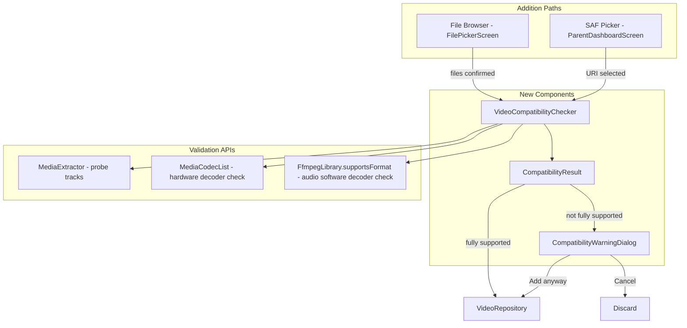
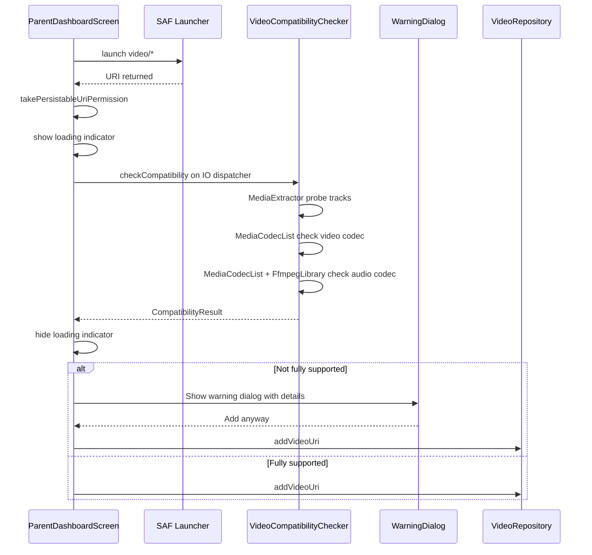
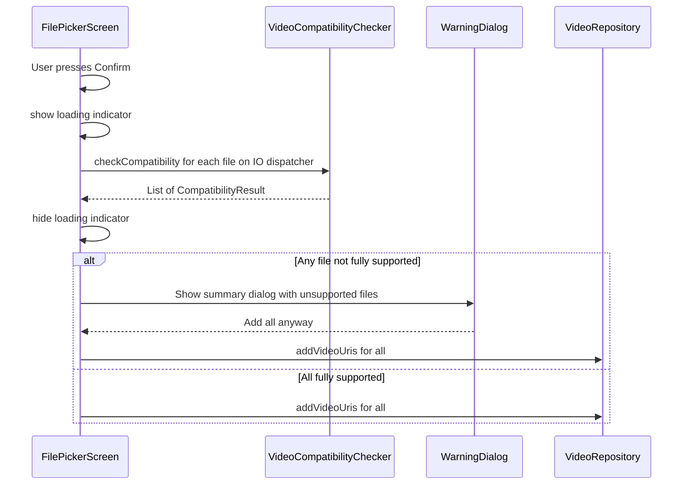

# Video Compatibility Pre-Validation Plan

## Problem Statement

The Kids Video Player app has **zero pre-validation** when adding videos. Videos are filtered only by file extension or `video/*` MIME type. If a video contains a codec not supported by the device (e.g., HEVC on an old device), it silently fails at playback time with a black screen — confusing for both parents and kids.

## Architecture Overview



### Validation Flow — SAF Picker (single file)



### Validation Flow — File Picker (batch)



---

## New Files to Create

### 1. `app/src/main/java/com/dima/kidsvideoplayer/player/CompatibilityResult.kt`

Data class holding the validation result.

```kotlin
package com.dima.kidsvideoplayer.player

/**
 * Result of a video compatibility check.
 *
 * @property isFullySupported  True if both video and audio tracks are playable on this device
 * @property videoCodec         Human-readable video codec name (e.g. "AVC/H.264", "HEVC/H.265"), null if no video track
 * @property audioCodec         Human-readable audio codec name (e.g. "AAC", "AC3", "E-AC3"), null if no audio track
 * @property videoSupported     True if the device has a hardware decoder for the video codec
 * @property audioSupported     True if the device has a hardware OR FFmpeg software decoder for the audio codec
 * @property warnings           Human-readable warning messages for unsupported tracks
 */
data class CompatibilityResult(
    val isFullySupported: Boolean,
    val videoCodec: String?,
    val audioCodec: String?,
    val videoSupported: Boolean,
    val audioSupported: Boolean,
    val warnings: List<String>
)
```

### 2. `app/src/main/java/com/dima/kidsvideoplayer/player/VideoCompatibilityChecker.kt`

Core validation utility. Uses `MediaExtractor` for probing + `MediaCodecList` for hardware checks + `FfmpegLibrary` for audio software decoder checks.

```kotlin
package com.dima.kidsvideoplayer.player

import android.content.Context
import android.media.MediaCodecList
import android.media.MediaExtractor
import android.media.MediaFormat
import android.net.Uri
import android.util.Log
import androidx.media3.decoder.ffmpeg.FfmpegLibrary
import kotlinx.coroutines.Dispatchers
import kotlinx.coroutines.withContext

class VideoCompatibilityChecker(private val context: Context) {

    companion object {
        private const val TAG = "VideoCompatChecker"

        /** Map of MIME type substrings to human-readable codec names */
        private val VIDEO_CODEC_NAMES = mapOf(
            "avc1" to "AVC/H.264",
            "avc" to "AVC/H.264",
            "hevc" to "HEVC/H.265",
            "vp8" to "VP8",
            "vp9" to "VP9",
            "av01" to "AV1",
            "mpeg4" to "MPEG-4",
            "mpeg2" to "MPEG-2",
            "s263" to "H.263"
        )

        private val AUDIO_CODEC_NAMES = mapOf(
            "mp4a" to "AAC",
            "aac" to "AAC",
            "ac-3" to "AC3",
            "ac3" to "AC3",
            "ec-3" to "E-AC3",
            "eac3" to "E-AC3",
            "opus" to "Opus",
            "vorbis" to "Vorbis",
            "flac" to "FLAC",
            "mp3" to "MP3",
            "dts" to "DTS",
            "truehd" to "TrueHD"
        )
    }

    /**
     * Check if a video file at the given URI is fully playable on this device.
     * Must be called on a background thread (uses IO dispatcher internally).
     *
     * Handles both content:// and file:// URI schemes.
     */
    suspend fun checkCompatibility(uri: Uri): CompatibilityResult =
        withContext(Dispatchers.IO) {
            // ... implementation below
        }

    // --- Private helpers ---

    /** Check if any hardware decoder on the device supports the given MIME type */
    private fun isHardwareDecoderAvailable(mimeType: String): Boolean { ... }

    /** Check if FFmpeg software decoder supports the given audio MIME type */
    private fun isFfmpegDecoderAvailable(mimeType: String): Boolean { ... }

    /** Map a raw MIME type to a human-readable codec name */
    private fun videoCodecName(mimeType: String): String { ... }

    /** Map a raw MIME type to a human-readable codec name */
    private fun audioCodecName(mimeType: String): String { ... }
}
```

#### Detailed `checkCompatibility` implementation sketch:

```kotlin
suspend fun checkCompatibility(uri: Uri): CompatibilityResult =
    withContext(Dispatchers.IO) {
        val extractor = MediaExtractor()
        try {
            // Set data source — different methods for content:// vs file://
            when (uri.scheme) {
                "content" -> extractor.setDataSource(context, uri, null)
                "file" -> extractor.setDataSource(uri.path)
                else -> return@withContext CompatibilityResult(
                    isFullySupported = false,
                    videoCodec = null,
                    audioCodec = null,
                    videoSupported = false,
                    audioSupported = false,
                    warnings = listOf("Unknown URI scheme: ${uri.scheme}")
                )
            }

            var videoCodec: String? = null
            var audioCodec: String? = null
            var videoSupported = true  // default: no video track = supported
            var audioSupported = true  // default: no audio track = supported
            var videoMime: String? = null
            var audioMime: String? = null
            val warnings = mutableListOf<String>()

            for (i in 0 until extractor.trackCount) {
                val format = extractor.getTrackFormat(i)
                val mime = format.getString(MediaFormat.KEY_MIME) ?: continue

                when {
                    mime.startsWith("video/") -> {
                        videoMime = mime
                        videoCodec = videoCodecName(mime)
                        val hwSupported = isHardwareDecoderAvailable(mime)
                        videoSupported = hwSupported
                        if (!hwSupported) {
                            warnings.add("Video codec $videoCodec ($mime) is not supported by this device")
                        }
                    }
                    mime.startsWith("audio/") -> {
                        audioMime = mime
                        audioCodec = audioCodecName(mime)
                        val hwSupported = isHardwareDecoderAvailable(mime)
                        val swSupported = isFfmpegDecoderAvailable(mime)
                        audioSupported = hwSupported || swSupported
                        if (!audioSupported) {
                            warnings.add("Audio codec $audioCodec ($mime) is not supported by this device")
                        }
                    }
                }
            }

            if (videoMime == null && audioMime == null) {
                warnings.add("No video or audio tracks found in the file")
            }

            CompatibilityResult(
                isFullySupported = videoSupported && audioSupported && warnings.isEmpty(),
                videoCodec = videoCodec,
                audioCodec = audioCodec,
                videoSupported = videoSupported,
                audioSupported = audioSupported,
                warnings = warnings
            )
        } catch (e: Exception) {
            Log.e(TAG, "Failed to check compatibility for $uri", e)
            CompatibilityResult(
                isFullySupported = false,
                videoCodec = null,
                audioCodec = null,
                videoSupported = false,
                audioSupported = false,
                warnings = listOf("Could not analyze file: ${e.message}")
            )
        } finally {
            extractor.release()
        }
    }
```

#### `isHardwareDecoderAvailable` implementation sketch:

```kotlin
private fun isHardwareDecoderAvailable(mimeType: String): Boolean {
    val codecList = MediaCodecList(MediaCodecList.REGULAR_CODECS)
    return codecList.decoderInfos.any { info ->
        !info.isEncoder && info.supportedTypes.contains(mimeType)
    }
}
```

#### `isFfmpegDecoderAvailable` implementation sketch:

```kotlin
private fun isFfmpegDecoderAvailable(mimeType: String): Boolean {
    return try {
        FfmpegLibrary.isAvailable && FfmpegLibrary.supportsFormat(mimeType)
    } catch (e: Exception) {
        Log.w(TAG, "FFmpeg library check failed", e)
        false
    }
}
```

### 3. `app/src/main/java/com/dima/kidsvideoplayer/ui/components/CompatibilityWarningDialog.kt`

Reusable Compose dialog for displaying compatibility warnings.

```kotlin
package com.dima.kidsvideoplayer.ui.components

@Composable
fun CompatibilityWarningDialog(
    results: List<Pair<String, CompatibilityResult>>,  // fileName to result
    onAddAnyway: () -> Unit,
    onCancel: () -> Unit
) {
    AlertDialog(
        onDismissRequest = onCancel,
        title = { Text("⚠️ Codec Compatibility Warning") },
        text = {
            Column {
                // For each file with issues:
                results.forEach { (fileName, result) ->
                    Text(fileName, fontWeight = Bold)
                    result.warnings.forEach { Text("• $it") }
                    Spacer(8.dp)
                }
                Text("The video may not play correctly on this device.")
            }
        },
        confirmButton = {
            TextButton(onClick = onAddAnyway) {
                Text("Add anyway")
            }
        },
        dismissButton = {
            TextButton(onClick = onCancel) {
                Text("Cancel")
            }
        }
    )
}
```

### 4. `app/src/test/java/com/dima/kidsvideoplayer/player/VideoCompatibilityCheckerTest.kt`

Unit tests for the compatibility checker.

---

## Existing Files to Modify

### 1. `AppState.kt` — Add `VideoCompatibilityChecker` to shared state

**What**: Add a `videoCompatibilityChecker` property to [`AppState`](app/src/main/java/com/dima/kidsvideoplayer/AppState.kt:21) and pass it through [`rememberAppState()`](app/src/main/java/com/dima/kidsvideoplayer/AppState.kt:54).

**Why**: Both [`ParentDashboardScreen`](app/src/main/java/com/dima/kidsvideoplayer/ui/screens/ParentDashboardScreen.kt:45) and [`FilePickerScreen`](app/src/main/java/com/dima/kidsvideoplayer/ui/screens/FilePickerScreen.kt:53) need access to the checker. Following the existing pattern of centralizing shared dependencies in `AppState`.

**Changes**:
```kotlin
@Stable
class AppState(
    val lockTaskManager: LockTaskManager,
    val videoRepository: VideoRepository,
    val videoPlayerManager: VideoPlayerManager,
    val videoCompatibilityChecker: VideoCompatibilityChecker,  // NEW
    val onEnterKidMode: () -> Unit,
    val onExitKidMode: () -> Unit,
    val onExitApp: () -> Unit
)
```

### 2. `MainActivity.kt` — Instantiate `VideoCompatibilityChecker`

**What**: Create the `VideoCompatibilityChecker` instance and pass it to `rememberAppState()`.

**Changes**:
```kotlin
val videoCompatibilityChecker = remember {
    VideoCompatibilityChecker(context.applicationContext)
}
val appState = rememberAppState(
    // ... existing params ...
    videoCompatibilityChecker = videoCompatibilityChecker,
)
```

### 3. `AppNavHost.kt` — Pass checker to both screens

**What**: Pass `appState.videoCompatibilityChecker` to [`ParentDashboardScreen`](app/src/main/java/com/dima/kidsvideoplayer/navigation/AppNavHost.kt:55) and [`FilePickerScreen`](app/src/main/java/com/dima/kidsvideoplayer/navigation/AppNavHost.kt:70).

**Changes**:
```kotlin
composable(Routes.PARENT_DASHBOARD) {
    ParentDashboardScreen(
        videoRepository = appState.videoRepository,
        videoCompatibilityChecker = appState.videoCompatibilityChecker,  // NEW
        onBackToKidMode = { ... },
        onNavigateToFilePicker = { ... },
        onExitApp = { ... }
    )
}

composable(Routes.FILE_PICKER) {
    FilePickerScreen(
        videoRepository = appState.videoRepository,
        videoCompatibilityChecker = appState.videoCompatibilityChecker,  // NEW
        onBack = { ... }
    )
}
```

### 4. `ParentDashboardScreen.kt` — Integrate check into SAF picker flow

**What**: After the SAF launcher returns a URI (line ~58), run `checkCompatibility()` before saving. Show loading indicator and warning dialog if needed.

**Key changes** (inside the `videoPickerLauncher` callback):

```kotlin
val videoPickerLauncher = rememberLauncherForActivityResult(
    contract = ActivityResultContracts.OpenDocument()
) { uri: Uri? ->
    uri?.let {
        // Take persistable permission so URI survives reboot
        try {
            context.contentResolver.takePersistableUriPermission(
                it,
                Intent.FLAG_GRANT_READ_URI_PERMISSION
            )
        } catch (e: Exception) {
            e.printStackTrace()
        }

        // NEW: Run compatibility check
        compatibilityCheckResult = null
        pendingUri = it.toString()
        isCheckingCompatibility = true
        coroutineScope.launch {
            val result = videoCompatibilityChecker.checkCompatibility(it)
            isCheckingCompatibility = false
            if (result.isFullySupported) {
                videoRepository.addVideoUri(it.toString())
            } else {
                compatibilityCheckResult = result
                // Dialog will be shown by Compose state observation
            }
        }
    }
}
```

**New state variables** to add inside the composable:
```kotlin
var isCheckingCompatibility by remember { mutableStateOf(false) }
var compatibilityCheckResult by remember { mutableStateOf<CompatibilityResult?>(null) }
var pendingUri by remember { mutableStateOf<String?>(null) }
```

**New UI elements**:
- `if (isCheckingCompatibility)` → show `CircularProgressIndicator` overlay
- `compatibilityCheckResult?.let { result -> CompatibilityWarningDialog(...) }` → show dialog

**New function parameter**:
```kotlin
@Composable
fun ParentDashboardScreen(
    videoRepository: VideoRepository,
    videoCompatibilityChecker: VideoCompatibilityChecker,  // NEW
    onBackToKidMode: () -> Unit,
    onNavigateToFilePicker: () -> Unit = {},
    onExitApp: () -> Unit = {}
)
```

### 5. `FilePickerScreen.kt` — Integrate check into batch confirm flow

**What**: When the user presses "Confirm" in the bottom bar (line ~358), run compatibility checks on all selected files before saving. Show a summary dialog for any unsupported files.

**Key changes** (inside `onConfirm` callback):

```kotlin
onConfirm = {
    coroutineScope.launch {
        val uris = selectedFiles.map { path ->
            File(path).toURI().toString()
        }

        // NEW: Check compatibility of all selected files
        isCheckingCompatibility = true
        val results = mutableMapOf<String, CompatibilityResult>()
        for (path in selectedFiles) {
            val uri = File(path).toURI()
            val result = videoCompatibilityChecker.checkCompatibility(uri)
            if (!result.isFullySupported) {
                results[File(path).name] = result
            }
        }
        isCheckingCompatibility = false

        if (results.isEmpty()) {
            // All supported — save directly
            if (uris.isNotEmpty()) {
                videoRepository.addVideoUris(uris)
            }
            onBack()
        } else {
            // Some unsupported — show dialog
            incompatibleResults = results.entries.map { it.key to it.value }
            pendingUris = uris
        }
    }
}
```

**New state variables**:
```kotlin
var isCheckingCompatibility by remember { mutableStateOf(false) }
var incompatibleResults by remember { mutableStateOf<List<Pair<String, CompatibilityResult>>>(emptyList()) }
var pendingUris by remember { mutableStateOf<List<String>?>(null) }
```

**New function parameter**:
```kotlin
@Composable
fun FilePickerScreen(
    videoRepository: VideoRepository,
    videoCompatibilityChecker: VideoCompatibilityChecker,  // NEW
    onBack: () -> Unit
)
```

---

## Detailed Implementation Steps

### Step 1: Create `CompatibilityResult.kt`

Create the data class in `app/src/main/java/com/dima/kidsvideoplayer/player/CompatibilityResult.kt`.

This is a pure data class with no dependencies beyond the Kotlin stdlib.

### Step 2: Create `VideoCompatibilityChecker.kt`

Create the checker in `app/src/main/java/com/dima/kidsvideoplayer/player/VideoCompatibilityChecker.kt`.

Key implementation details:

1. **`MediaExtractor` probing**: Use `setDataSource(context, uri, null)` for `content://` URIs and `setDataSource(path)` for `file://` URIs. Iterate `trackCount` and read `MediaFormat.KEY_MIME` from each track format.

2. **Hardware decoder check**: Use `MediaCodecList(REGULAR_CODECS)` which returns only stable, non-experimental decoders. Check `decoderInfos.any { !it.isEncoder && it.supportedTypes.contains(mimeType) }`.

3. **FFmpeg audio check**: Call `FfmpegLibrary.isAvailable()` first (guards against missing native lib), then `FfmpegLibrary.supportsFormat(mimeType)`. The `supportsFormat` method internally maps MIME types to FFmpeg codec names and checks if the native build includes that decoder.

4. **Codec name mapping**: Map MIME subtypes to human-readable names. For example:
   - `video/avc` → "AVC/H.264"
   - `video/hevc` → "HEVC/H.265"
   - `audio/mp4a-latm` → "AAC"
   - `audio/ac3` → "AC3"

5. **Error handling**: Wrap the entire probe in try/catch. If `MediaExtractor` fails (corrupt file, DRM, etc.), return a result with `isFullySupported = false` and a warning explaining the failure.

6. **Threading**: The public `checkCompatibility()` method is a `suspend fun` that switches to `Dispatchers.IO`.

### Step 3: Create `CompatibilityWarningDialog.kt`

Create the dialog composable in `app/src/main/java/com/dima/kidsvideoplayer/ui/components/CompatibilityWarningDialog.kt`.

Design:
- Title: "⚠️ Codec Compatibility Warning" (or localized Russian equivalent)
- Body: List each file with issues, showing its codec details and specific warnings
- Buttons: "Add anyway" (orange/warning color) and "Cancel" (neutral)
- For the SAF picker (single file): simpler layout with just the codec details
- For the file picker (batch): scrollable list of files with issues

### Step 4: Modify `AppState.kt`

Add `videoCompatibilityChecker` property to the `AppState` class. Update `rememberAppState()` to accept and forward the new parameter.

### Step 5: Modify `MainActivity.kt`

Instantiate `VideoCompatibilityChecker` with `applicationContext` and pass to `rememberAppState()`.

### Step 6: Modify `AppNavHost.kt`

Pass `appState.videoCompatibilityChecker` to both `ParentDashboardScreen` and `FilePickerScreen`.

### Step 7: Modify `ParentDashboardScreen.kt`

1. Add `videoCompatibilityChecker` parameter
2. Add state variables: `isCheckingCompatibility`, `compatibilityCheckResult`, `pendingUri`
3. Modify the SAF launcher callback to run the check after URI selection
4. Add a loading overlay (`CircularProgressIndicator`) when `isCheckingCompatibility` is true
5. Add the `CompatibilityWarningDialog` when `compatibilityCheckResult` is non-null
6. Dialog "Add anyway" saves the pending URI and clears state; "Cancel" clears state without saving

### Step 8: Modify `FilePickerScreen.kt`

1. Add `videoCompatibilityChecker` parameter
2. Add state variables: `isCheckingCompatibility`, `incompatibleResults`, `pendingUris`
3. Modify the `onConfirm` callback to run checks on all selected files
4. Add a loading overlay when `isCheckingCompatibility` is true
5. Add the `CompatibilityWarningDialog` when `incompatibleResults` is non-empty
6. Dialog "Add anyway" saves all URIs and navigates back; "Cancel" clears state without saving

### Step 9: Write unit tests

Create `VideoCompatibilityCheckerTest.kt` with tests for:
- `CompatibilityResult` data class construction
- Codec name mapping logic
- Hardware decoder availability check (mocked `MediaCodecList`)
- FFmpeg fallback check (mocked `FfmpegLibrary`)
- Error handling for corrupt files / unreadable URIs

---

## Error Handling Strategy

| Scenario | Handling |
|---|---|
| `MediaExtractor.setDataSource` throws IOException | Return result with `isFullySupported=false`, warning: "Could not read file" |
| `MediaExtractor.setDataSource` throws SecurityException | Return result with `isFullySupported=false`, warning: "Permission denied" |
| Unknown URI scheme (not content:// or file://) | Return result with `isFullySupported=false`, warning: "Unknown URI scheme" |
| No video or audio tracks found | Return result with `isFullySupported=false`, warning: "No playable tracks found" |
| File has only audio track, no video | `videoSupported=true` (vacuously true), `videoCodec=null` |
| `FfmpegLibrary` not loaded / native lib missing | Gracefully skip FFmpeg check, rely on hardware-only for audio |
| `MediaCodecList` query fails | Return result with `isFullySupported=false`, warning: "Could not query device capabilities" |
| Multiple video/audio tracks | Check all tracks; report unsupported for any that fail |
| DRM-protected content | `MediaExtractor` may succeed but `MediaFormat` may lack KEY_MIME; handle null MIME gracefully |

### Cancellation handling

If the user navigates away while a compatibility check is in progress (e.g., presses back), the coroutine launched via `rememberCoroutineScope()` will be cancelled automatically when the composable leaves the composition. The `withContext(Dispatchers.IO)` block inside `checkCompatibility` will respect cancellation at the suspension point. `MediaExtractor` operations are blocking but fast (typically <100ms), so there is no risk of long-running orphaned I/O.

---

## Codec Name Mapping Reference

### Video MIME types → Display names

| MIME type | Display name |
|---|---|
| `video/avc` | AVC/H.264 |
| `video/hevc` | HEVC/H.265 |
| `video/x-vnd.on2.vp8` | VP8 |
| `video/x-vnd.on2.vp9` | VP9 |
| `video/av01` | AV1 |
| `video/mp4v-es` | MPEG-4 |
| `video/mpeg2` | MPEG-2 |
| `video/3gpp` | H.263 |

### Audio MIME types → Display names

| MIME type | Display name |
|---|---|
| `audio/mp4a-latm` | AAC |
| `audio/aac` | AAC |
| `audio/ac3` | AC3 |
| `audio/eac3` | E-AC3 |
| `audio/opus` | Opus |
| `audio/vorbis` | Vorbis |
| `audio/flac` | FLAC |
| `audio/mpeg` | MP3 |
| `audio/raw` | PCM |
| `audio/amr-wb` | AMR-WB |
| `audio/amr-nb` | AMR-NB |

---

## File Summary

### New files (4)

| File | Purpose |
|---|---|
| `app/src/main/java/com/dima/kidsvideoplayer/player/CompatibilityResult.kt` | Data class for check results |
| `app/src/main/java/com/dima/kidsvideoplayer/player/VideoCompatibilityChecker.kt` | Core validation logic |
| `app/src/main/java/com/dima/kidsvideoplayer/ui/components/CompatibilityWarningDialog.kt` | Warning dialog composable |
| `app/src/test/java/com/dima/kidsvideoplayer/player/VideoCompatibilityCheckerTest.kt` | Unit tests |

### Modified files (5)

| File | Change |
|---|---|
| `AppState.kt` | Add `videoCompatibilityChecker` property |
| `MainActivity.kt` | Instantiate and pass `VideoCompatibilityChecker` |
| `AppNavHost.kt` | Pass checker to both screens |
| `ParentDashboardScreen.kt` | Add check after SAF picker, add warning dialog |
| `FilePickerScreen.kt` | Add check on batch confirm, add warning dialog |

---

## Out of Scope

The following are explicitly **not** part of this plan but noted for future consideration:

- **Playback-time error UI in `KidPlayerScreen`**: Showing an error overlay or auto-skipping to the next video when playback fails. This is a separate concern.
- **Background validation of existing videos**: Scanning already-saved videos and flagging incompatible ones.
- **Transcoding or format conversion**: Converting unsupported videos to supported formats.
- **Video codec software decoding via FFmpeg**: The current FFmpeg module only handles audio. Adding video software decoding would require significant native library changes.
